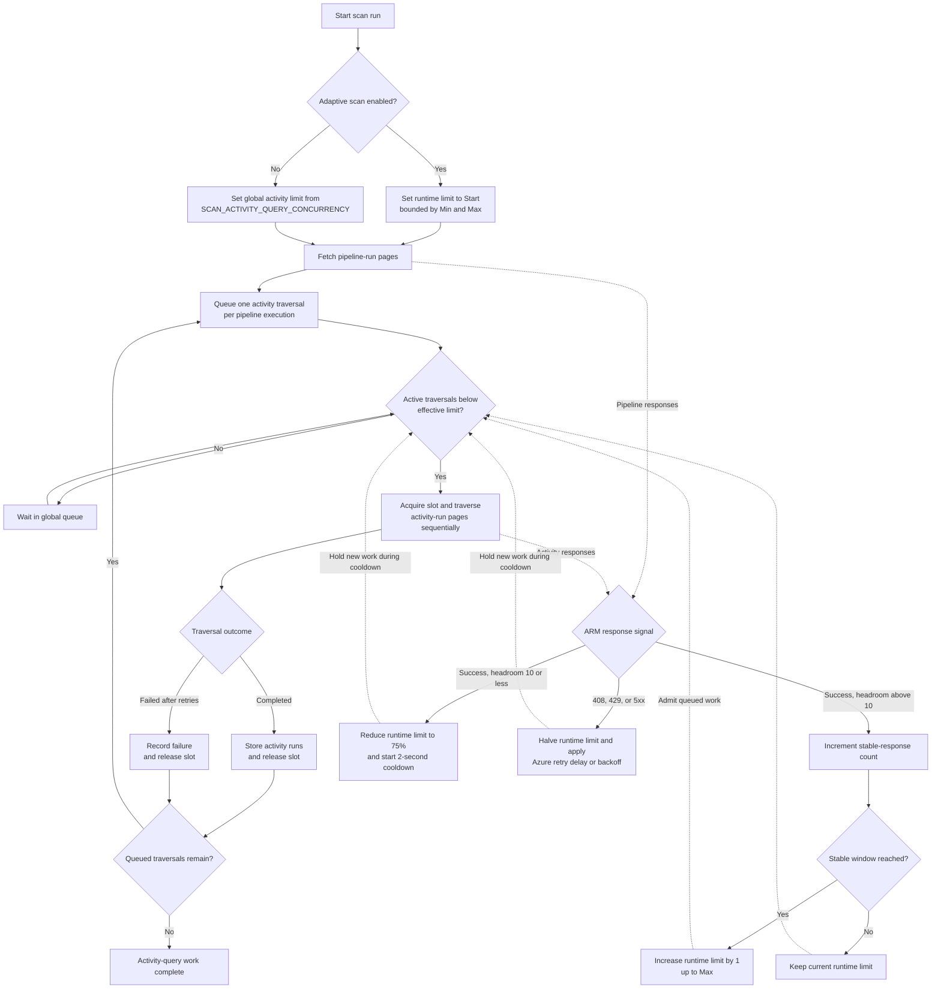

# ADF Migration Planner

Internal dev-mode SPA for Microsoft Entra interactive sign-in, Azure subscription discovery, Azure Data Factory inventory, and usage-to-Fabric capacity estimation.

See [CHANGELOG.md](CHANGELOG.md) for release history.

## What This App Does

1. Signs in with Microsoft Entra using MSAL.
2. Discovers subscriptions visible to the signed-in account.
3. Inventories Azure Data Factory resources by subscription.
4. Lets you select which factories to scan.
5. Scans usage in day chunks for a selected profile (1, 3, 5, 7 days).
6. Computes DIU-hours, Fabric CUh estimates, and peak daily CU requirement.
7. Persists run state in IndexedDB for progress visibility and restartability.
8. Exports usage summary to Excel.

## Quickstart

New here? Start with the [Quickstart guide](docs/QUICKSTART.md). It documents every prerequisite, the exact Azure access the signed-in user needs, configuration, and your first scan.

Short version:

1. Configure a Microsoft Entra SPA app registration and set `.env.local`.
2. Grant the signed-in user `Reader` (or the granular actions) on target subscriptions.
3. Run `./start.ps1 -UseCurrentRepo` (or `npm run api:dev` and `npm run dev`).
4. Sign in, run inventory, select factories, and start a scan.
5. Review the usage summary and export to Excel.

## Architecture Overview

The app has two parts:

1. Frontend SPA (React + Vite + TypeScript) — handles interactive sign-in, inventory, selection, progress UI, local persistence, and export.
2. Backend scan API (local Node.js service) — executes Data Factory usage scans off the browser thread and exposes run status/results for polling.

Runtime flow:

1. The SPA signs in with MSAL and acquires an ARM token.
2. The SPA discovers subscriptions and inventories Data Factory resources via Azure Resource Graph.
3. On scan, the SPA forwards the ARM token to the backend, which queries pipeline and activity run history in day chunks.
4. Aggregated metrics are written back to the SPA and persisted in IndexedDB.

## Prerequisites

1. Windows, macOS, or Linux with a modern browser.
2. Node.js 20+ and npm.
3. Git (required for bootstrap script or clone workflow).
4. A Microsoft Entra app registration configured as a SPA.
5. Azure access for the signed-in user to list subscriptions and read ADF run history (see below).
6. Azure CLI (optional) — only for running the backend API standalone without a forwarded SPA token.

## Azure And Entra Setup

### 1. App registration

Create or reuse a Microsoft Entra app registration with:

1. Platform type: Single-page application.
2. Redirect URI: [http://localhost:5173](http://localhost:5173)
3. Public client SPA flow (authorization code flow with PKCE, no client secret).

Delegated API permissions to grant on the app registration:

1. Azure Service Management → `user_impersonation` (call ARM as the signed-in user).
2. Microsoft Graph → `User.Read` (basic sign-in/profile).

Grant admin consent if your tenant requires it.

### 2. Required Azure access for the signed-in user

The app is read-only and can only return data the signed-in user is authorized to read. Grant access on every target subscription (or a narrower scope to limit visibility).

Recommended: assign the built-in `Reader` role at subscription scope. This covers subscription enumeration, Resource Graph discovery, and pipeline/activity run reads.

Granular alternative (for restricted environments), include these actions in a custom role:

| Purpose | Action |
| --- | --- |
| List subscriptions | `Microsoft.Resources/subscriptions/read` |
| Resource Graph discovery | `Microsoft.ResourceGraph/resources/read` |
| Read Data Factory resources | `Microsoft.DataFactory/factories/read` |
| Query pipeline runs | `Microsoft.DataFactory/factories/queryPipelineRuns/action` |
| Read pipeline runs | `Microsoft.DataFactory/factories/pipelineruns/read` |
| Query activity runs | `Microsoft.DataFactory/factories/pipelineruns/queryActivityruns/action` |
| Read activity runs | `Microsoft.DataFactory/factories/activityruns/read` |

Notes:

1. Subscription enumeration requires at least one RBAC role assignment at subscription scope.
2. Missing access on a subscription surfaces as a failed subscription entry, not a full run failure.
3. No write permissions are required.

## Configuration

Copy [.env.local.example](.env.local.example) to `.env.local` and set values:

```env
VITE_AUTH_MODE=msal
VITE_AZURE_CLIENT_ID=<your-spa-app-client-id>
VITE_AZURE_TENANT_ID=organizations
VITE_AZURE_REDIRECT_URI=http://localhost:5173
```

Notes:

1. The app will not sign in without `VITE_AZURE_CLIENT_ID`.
2. If you see `AADSTS700038`, check that client ID is real and not placeholder.
3. If you see `AADSTS50011`, confirm redirect URI exactly matches the app registration.

### Alternate Azure CLI authentication

If `AADSTS50105` blocks the user because the tenant requires assignment to this app, the local development app can reuse an approved Azure CLI session instead:

```powershell
az login --tenant <customer-tenant-id>
az account set --subscription <subscription-id>
```

Set `.env.local` to:

```env
VITE_AUTH_MODE=azure-cli
VITE_SCAN_API_BASE_URL=http://localhost:7071
```

The SPA client ID is not required in this mode. Subscription discovery, Resource Graph inventory, and usage scans run through the local Node API; ARM tokens are not returned to the browser. The API binds to `127.0.0.1` by default.

This mode does not bypass tenant security policy. Azure CLI must be permitted by Conditional Access, and the CLI user still needs the Azure RBAC permissions listed above. If Shell also blocks the Azure CLI enterprise application, the app owner or IAM process must provide an approved client or workload identity.

### Service principal client-secret authentication

A browser SPA cannot keep a client secret. This mode uses MSAL Node in the local backend as a confidential client. The browser receives inventory data, not the secret or the service principal's ARM token.

Set the frontend mode in `.env.local`:

```env
VITE_AUTH_MODE=client-secret
VITE_SCAN_API_BASE_URL=http://localhost:7071
```

Set backend process variables before starting the app:

```powershell
$env:SCAN_AUTH_MODE = 'client-secret'
$env:AZURE_TENANT_ID = '<tenant-id>'
$env:AZURE_CLIENT_ID = '<app-client-id>'
$env:AZURE_CLIENT_SECRET = '<client-secret>'
./start.ps1 -UseCurrentRepo
```

Do not put `AZURE_CLIENT_SECRET` in `.env.local`, any `VITE_*` variable, source control, or browser storage. Grant the app's service principal `Reader` or the granular role described above on each target scope. Client credentials run as the service principal, not as the customer user, so user assignment does not apply.

For a hosted deployment, replace the secret with managed identity or a certificate. If a secret is required, store it in Azure Key Vault and define a rotation schedule.

## Installation And Startup

### Option A: Manual

1. Install dependencies:

   ```powershell
   npm install
   ```

2. Start the dev server:

   ```powershell
   npm run dev
   ```

3. Open the shown local URL (default [http://localhost:5173](http://localhost:5173)).

### Option B: Bootstrap script

Use [start.ps1](start.ps1) to clone/update/install/run:

```powershell
./start.ps1
```

Current script behavior:

1. Prompts for a git repository URL when `-RepoUrl` is not passed and `-UseCurrentRepo` is not set. Leaving the prompt blank skips all git commands and uses the current folder instead.
2. Clears local `node_modules` folders (`./node_modules` and `./server/node_modules`) before install when `-SkipInstall` is not used.
3. Clears npm cache (`npm cache clean --force`) before install when `-SkipInstall` is not used.
4. Starts backend API dev server in a separate PowerShell window.
5. Starts frontend Vite dev server in the current window.
6. Stops the backend API process automatically when the frontend process exits.

Useful switches:

1. `-RepoUrl <url>` clone from this URL without prompting.
2. `-UseCurrentRepo` use current folder instead of cloning, without prompting.
3. `-BootstrapOnly` clone/update/install without starting dev server.
4. `-SkipInstall` skip `npm install`.

## Backend Scan API

The repository includes a backend scan API in [server/package.json](server/package.json).

Why this exists:

1. Move heavy scan execution off the browser thread.
2. Keep UI responsive while scans run.
3. Support server-side run status and result polling.

Current auth mode:

1. SPA usage scans forward the current MSAL ARM token to the backend API.
2. Backend falls back to Azure CLI token acquisition only when a token is not provided.
3. Optional local Azure CLI sign-in (useful for direct API testing):

    ```powershell
    az login
    ```

Run the backend:

```powershell
npm run api:dev
```

The API listens on `http://localhost:7071`.

Frontend usage-scan integration:

1. Scan selected factories now runs through this backend API.
2. Keep the backend running while triggering usage scans from the SPA.

Optional frontend API settings in `.env.local`:

```env
VITE_SCAN_API_BASE_URL=http://localhost:7071
VITE_SCAN_API_POLL_MS=1500
VITE_MSAL_TOKEN_TIMEOUT_MS=30000
VITE_ARM_FETCH_TIMEOUT_MS=45000
VITE_DB_PREP_TIMEOUT_MS=15000
VITE_INVENTORY_DISCOVERY_TIMEOUT_MS=45000
VITE_INVENTORY_SUBSCRIPTION_TIMEOUT_MS=45000
VITE_SCAN_NO_PROGRESS_TIMEOUT_MS=120000
```

Optional backend settings (environment variables for the API process):

```env
HOST=127.0.0.1
PORT=7071
SCAN_AUTH_MODE=azure-cli
# Required only when SCAN_AUTH_MODE=client-secret:
AZURE_TENANT_ID=<tenant-id>
AZURE_CLIENT_ID=<app-client-id>
AZURE_CLIENT_SECRET=<client-secret>
SCAN_API_ALLOWED_ORIGIN=http://localhost:5173
SCAN_ARM_FETCH_TIMEOUT_MS=60000
SCAN_ARM_FETCH_MAX_RETRIES=5
SCAN_ACTIVITY_QUERY_CONCURRENCY=4
SCAN_DAY_WINDOW_CONCURRENCY=3
SCAN_FACTORY_CONCURRENCY=2
SCAN_ADAPTIVE_CONCURRENCY_MIN=1
SCAN_ADAPTIVE_CONCURRENCY_START=3
SCAN_ADAPTIVE_CONCURRENCY_MAX=8
SCAN_ADAPTIVE_CONCURRENCY_STABLE_WINDOW=3
SCAN_MAX_RETAINED_RUNS=50
SCAN_DATABASE_PATH=server/data/adf-migration-planner.sqlite
SCAN_LOG_DIRECTORY=server/logs
```

### Scan trace logs

**Trace log** is enabled by default in the Factory inventory scan controls. Each click on **Scan selected factories** creates a separate JSON Lines file named `<backend-run-id>.jsonl`. Disable the toggle before starting a scan when no file should be written.

The trace records:

1. Selected factories and scan-window settings.
2. Fixed and effective factory, day-window, and activity-query concurrency.
3. Adaptive limit changes, cooldowns, and throttle signals.
4. Azure CLI token command timing when CLI authentication is used.
5. ARM failures, network errors, retry delays, status codes, durations, and failed response bodies up to 16 KiB.
6. Factory, day-window, and pipeline-run context for failures, plus final throughput.

**Verbose trace** is off by default. Enable it before starting a scan to also record `arm-request-started` and successful `arm-request-completed` events for every request attempt. These events include the request method, URL, payload, attempt number, duration, and remaining rate-limit value, and can add thousands of lines to a large scan log. Direct API callers can set `traceVerboseEnabled: true`; the default is `false`.

Authorization headers, access tokens, client secrets, and fields whose names contain `token`, `secret`, or `authorization` are replaced with `[REDACTED]`. Logs are stored in `server/logs` by default. Set `SCAN_LOG_DIRECTORY` to an absolute path, or a path relative to the API process working directory, to store them elsewhere.

After the backend accepts a trace-enabled scan, the UI shows **Download trace log** beside the scan button. The file can also be downloaded from `GET /api/runs/<backend-run-id>/log`, including while the scan is running.

The **Scan trace viewer** in the UI can load the current backend trace or open a previously downloaded `.jsonl` or `.ndjson` file. Use **Level** and **Event** for exact filters, or **Search trace** to match any value in an entry, including factory names, URLs, statuses, and error text. Select an entry to inspect its formatted JSON. **Refresh live trace** reads the file again while a scan is still running. Malformed lines are skipped and counted so valid entries remain available. Filters search the full file; the viewer renders the newest 500 matches to keep large traces responsive.

### Adaptive scanning

An ADF activity-run query is issued once for each pipeline execution. A factory with 1,000 pipeline executions therefore needs about 1,000 activity-run queries, plus any continuation-page requests. Adaptive scanning controls how many pipeline executions can have an activity-run traversal in progress at the same time.

The activity-query limit is global to one scan run. Factories and day chunks do not receive separate allowances. For example, an effective limit of `6` permits at most six activity-run traversals across all factories and day chunks in that run. A traversal keeps its slot while it follows continuation tokens or retries a transient request.

#### Settings

| Setting | Default | Behavior |
| --- | ---: | --- |
| `SCAN_ACTIVITY_QUERY_CONCURRENCY` | `2` | Fixed global activity-query limit when adaptive scanning is disabled. |
| `SCAN_ADAPTIVE_CONCURRENCY_MIN` | `1` | Lowest configured adaptive limit. |
| `SCAN_ADAPTIVE_CONCURRENCY_START` | `3` | Effective activity-query limit at the start of a run. |
| `SCAN_ADAPTIVE_CONCURRENCY_MAX` | `8` | Highest adaptive limit. |
| `SCAN_ADAPTIVE_CONCURRENCY_STABLE_WINDOW` | `3` | Successful ARM responses required to raise the limit by one. |

The scan form sends its **Min / Start / Max** and **Stable window** values with each run. Those values override the backend `SCAN_ADAPTIVE_*` defaults for that run. Direct API callers can send the same values in the `adaptive` object. If the request omits `adaptive`, the backend environment defaults apply.

Disabling **Adaptive scan** makes `SCAN_ACTIVITY_QUERY_CONCURRENCY` the fixed global limit. The UI does not currently expose that fixed value, so set it in the backend process environment before starting the API.

#### Runtime changes

The backend maintains an effective runtime limit; it does not change the process environment variables.



1. The limit begins at **Start**.
2. Each successful ARM response contributes to the stable-response counter. Pipeline-run pages and activity-run pages both count.
3. After **Stable window** successful responses, the limit increases by one, up to **Max**.
4. An HTTP `408`, `429`, or `5xx` response halves the configured runtime limit and honors Azure's retry delay. While the cooldown is active, the effective limit is reduced by one more slot, but never below **Min**.
5. If an ARM rate-limit response header reports 10 or fewer remaining operations, the configured runtime limit falls to 75 percent of its current value and enters a two-second cooldown.
6. A decrease does not cancel requests already in flight. New activity traversals wait until the active count falls below the new limit.

Transient requests use exponential backoff when Azure does not provide a retry delay. They are retried up to `SCAN_ARM_FETCH_MAX_RETRIES`; retries continue to occupy the same activity-query slot.

#### Outer concurrency

Adaptive scanning directly gates activity-run traversal. Two separate settings control how quickly work reaches that gate:

| Setting | Default | Scope |
| --- | ---: | --- |
| `SCAN_FACTORY_CONCURRENCY` | `2` | Factories processed concurrently. |
| `SCAN_DAY_WINDOW_CONCURRENCY` | `3` | Day chunks processed concurrently within each factory. |

Pipeline-run page requests are not admitted through the activity-query gate. They share the adaptive controller's success, throttle, and cooldown signals, so they can cause the activity limit to rise or fall. The factory and day worker counts are selected when their worker pools start and are not resized during that run.

#### Tuning

Use the defaults first. Change one boundary at a time and compare total calls, calls per second, scan duration, and throttle errors in the completed factory note.

| Workload | Min | Start | Max | Stable window | Rationale |
| --- | ---: | ---: | ---: | ---: | --- |
| Shared subscription or frequent throttling | 1 | 2 | 4 | 10 | Ramps slowly and keeps the peak request count low. |
| General scan | 1 | 3 | 8 | 3 | Current default behavior. |
| High-volume factory with observed rate-limit headroom | 2 | 6 | 12 | 10 | Starts faster but requires ten successful responses for each increase. |

Do not set **Min** higher than the concurrency level Azure has sustained without throttling. A high minimum prevents the controller from reducing pressure far enough after a `429`. Raising **Max** only helps when enough pipeline executions are queued; it does not parallelize continuation pages for one pipeline execution.

The backend uses embedded SQLite as the authoritative local scan store. It persists runs, selected factories, factory summaries, daily metrics, pipeline runs, activity runs (including start/end timestamps), scan errors, and day checkpoints. The default database is `server/data/adf-migration-planner.sqlite`; no separate database service is required. Browser IndexedDB remains a UI cache for inventory and summary rendering.

Available endpoints:

1. `GET /health`
2. `GET /api/runs`
3. `POST /api/runs`
4. `GET /api/runs/:runId/status`
5. `GET /api/runs/:runId/results`

Example `POST /api/runs` body:

```json
{
   "windowDays": 3,
   "factories": [
      {
         "id": "/subscriptions/<sub>/resourceGroups/<rg>/providers/Microsoft.DataFactory/factories/<name>",
         "name": "<name>",
         "subscriptionId": "<sub>",
         "resourceGroup": "<rg>",
         "location": "<location>"
      }
   ]
}
```

## Operation Guide

### 1. Sign in

1. Click Sign in.
2. Complete Entra interactive authentication.

### 2. Discover inventory

1. Click Start inventory run.
2. The app discovers subscriptions and inventories factories.

### 3. Filter and select factories

In Factory inventory you can:

1. Filter by subscription.
2. Use free-text search (name/resource group/location/subscription).
3. Hide already scanned factories.
4. Select individual rows or Select all visible rows.

### 4. Choose scan profile

Pick one profile before scanning selected factories:

1. Today - 1 day
2. Today - 3 days
3. Today - 5 days
4. Today - 7 days

### 5. Run scan

1. Click Scan selected factories.
2. The collector scans by day chunks inside the selected window.
3. Progress indicators show:
   - subscription inventory progress
   - factory usage progress
   - day-chunk progress

### 6. Debug mode

1. Debug mode is **off by default**.
2. Turn on **Debug mode** in Execution status to show **Debug trace**.
3. Debug trace lists latest run step events (newest first) for troubleshooting.

### 7. Review results

1. Review the Usage summary table for per-factory metrics.
2. Results are retained across additional scans and updated per factory.
3. Use **Clear results** in Usage summary when you want to remove saved usage rows.

### 8. Export

Use Export to Excel in Usage summary to download the current run results.

## Metrics And Calculations

Usage summary includes:

1. Activity and pipeline execution counts.
2. Pipeline and external pipeline minutes.
3. Copy data moved (GiB) derived from Copy activity output bytes.
4. Window DIU-hours.
5. Mapping dataflow run count and vCore minutes.
6. Fabric CUh estimates.
7. Max daily CUh.
8. Peak daily CU required.

Key calculations:

1. DIU-hours = sum(usedDataIntegrationUnits x copyDurationSeconds / 3600)
2. Mapping Dataflow CUh = (mapping dataflow vCore minutes / 60) * 0.5
3. Estimated Fabric CUh = (DIU-hours x 1.5) + (orchestration activity runs x 0.0056) + Mapping Dataflow CUh
4. Peak Daily CU Required = max(daily estimated Fabric CUh) / 24

## Data And State

1. Run and progress state are stored in browser IndexedDB.
2. Data is local to the browser profile/machine.
3. Usage results are retained across runs until cleared with **Clear results**.
4. Inventory refresh clears and rebuilds subscription/factory/progress metadata for the active run.

## Troubleshooting

1. Blank screen after updates:
   - Hard refresh the page.
   - Re-run inventory and scan to repopulate latest fields.
2. Sign-in loop or redirect failure:
   - Validate `.env.local` values.
   - Validate redirect URI in Entra app registration.
3. Scan is slow on high-run factories:
   - Use smaller scan profile (1 or 3 days).
   - Filters reduce total scanned factories.
   - Recent builds use bounded concurrency for activity-run queries.
4. Partial results:
   - Day-chunk scanning continues even when a chunk fails.
   - Check progress and rerun selected factories.
5. Failed scan with no useful UI error:
   - Keep **Trace log** enabled before starting the scan.
   - Download the trace after the failure and inspect `error`, `arm-request-failed`, `arm-request-error`, and `adaptive-concurrency-changed` events.
   - Confirm the trace's `scan-runtime-settings` event matches the intended scale and parallelism values.

## Build

```powershell
npm run build
```

## References

1. [MSAL Browser overview](https://learn.microsoft.com/entra/msal/javascript/browser/about-msal-browser)
2. [MSAL React SPA preparation](https://learn.microsoft.com/entra/identity-platform/tutorial-single-page-app-react-prepare-app#add-the-authentication-provider)
3. [Azure Resource Graph query language](https://learn.microsoft.com/azure/governance/resource-graph/concepts/query-language)
4. [Azure Resource Graph REST syntax](https://learn.microsoft.com/azure/governance/resource-graph/first-query-rest-api#review-the-rest-api-syntax)
5. [Data Factory pipeline runs query API](https://learn.microsoft.com/rest/api/datafactory/pipeline-runs/query-by-factory)
6. [Data Factory activity runs query API](https://learn.microsoft.com/rest/api/datafactory/activity-runs/query-by-pipeline-run)
